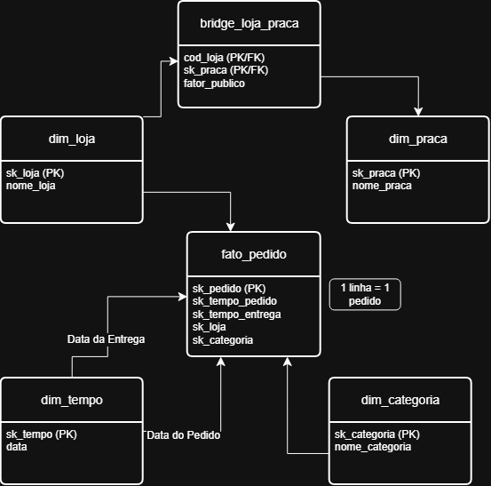

# Pata Amiga — Modelo Dimensional (MiniprojetoMod2_KauanAnjos_Analise_de_Dados_T1)

## 1. Contexto
A Pata Amiga é uma rede catarinense de pet shops com 32 lojas. Em setembro de 2023, a operação de pedidos com entrega (via app, site, telefone, WhatsApp e loja física) foi implementada. Ao longo de sete meses, foram registrados 4.044 pedidos. 

O desafio deste projeto foi integrar dados provenientes de três sistemas distintos (plataforma de e-commerce, cadastro de lojas e planilha de praças) que possuíam graves problemas de padronização estrutural e semântica. O objetivo final é fornecer respostas confiáveis para a diretoria sobre o gargalo logístico, o faturamento por categoria, a eficácia da política de descontos por canal e a performance por praça, embasando a decisão de onde abrir a próxima loja.

## 2. O modelo construído

- **Grão da fato_pedido:** 1 linha = 1 pedido (exatamente 4.044 linhas).
- **Dimensões:** 
  - `dim_tempo` (role-playing dimension — atua em papel duplo, registrando a data do pedido e a data da entrega).
  - `dim_loja` (cadastro de lojas).
  - `dim_categoria` (categorias de produtos unificadas).
  - `dim_praca` (ligada indiretamente à fato através da tabela auxiliar `bridge_loja_praca`, para resolver a cardinalidade N:N do rateio).

## 3. Diagnóstico da origem
A análise exploratória nas áreas de staging revelou inconsistências críticas que exigiram tratamento:

| Item | Quantidade | Observação |
|---|---|---|
| Grafias distintas de loja | 128 | (127 grafias com erros/abreviações + 1 em branco) |
| Grafias distintas de categoria | 37 | Exigiu de-para padronizando em 7 categorias principais. |
| Pedidos sem código de loja | 1.575 | Quase 40% dos pedidos precisaram de junção via nome da loja. |
| Pedidos sem nome de loja | 3 | Tratados utilizando o conceito de linha -1 (Não Informado). |
| Marcos em branco (separação / nota / despacho / entrega) | 1.077 / 1.338 / 1.665 / 1.953 | Processos ainda em aberto, requerem tratamento de nulos. |

Linhas em `stg_pedido` / `stg_loja` / `stg_loja_praca` | 4.044 / 32 / 48 |
| Grafias distintas de `CategoriaProduto` | **37** |
| Grafias distintas de `Loja-Nome` | **128** (127 grafias reais + 1 em branco, que representa os 3 pedidos sem loja) |
| Grafias distintas de `HouveDesconto` | **17** |
| Grafias distintas de `CanalPedido` | **20** |
| Pedidos sem 'Cod Loja' preenchido | **1.575** (~39%) |
| Pedidos sem `Loja-Nome` (vão para a linha -1) | **3** |
| `Dt Separacao Estoque` em branco | **1.077** |
| `DtNotaFiscal` em branco | **1.338** |
| `Dt_Despacho_Transportadora` em branco | **1.665** |
| `DtEntregaCliente` em branco | **1.953** |

| mascara_americana_ok | esperado |
| -------------------- | -------- |
| 4044                 | 4044     |

| tabela    | linhas | esperado               |
| --------- | ------ | ---------------------- |
| dim_tempo | 236    | 236  (235 dias + a -1) |
| dim_loja  | 33     | 33  (32 lojas + a -1)  |

| tabela            | deve_estar_vazia |
| ----------------- | ---------------- |
| dim_categoria     | 38               |
| dim_praca         | 13               |
| bridge_loja_praca | 48               |
| fato_pedido       | 4044             |

| tabela            | linhas | esperado                           |
| ----------------- | ------ | ---------------------------------- |
| dim_categoria     | 38     | 38 no PostgreSQL - varia por banco |
| dim_praca         | 13     | 13  (12 pracas + a -1)             |
| bridge_loja_praca | 48     | 48                                 |
| categorias_padronizadas | esperado                         |
| ----------------------- | -------------------------------- |
| 8                       | 8 = as 7 categorias + a linha -1 |

-- Se aparecer 'Nao Informado' numa linha que nao e a -1, algum WHEN do CASE nao
-- classificou a grafia. A consulta deve voltar VAZIA.
Success. No rows returned

| categoria_origem    | nome_categoria | esperado    |
| ------------------- | -------------- | ----------- |
| Racao Medicamentosa | Medicamento    | Medicamento |
| Ração Medicamentosa | Medicamento    | Medicamento |

-- A ponte: o fator deve somar 1,00 em cada loja. A consulta deve voltar VAZIA.
Success. No rows returned

| teste           | valor | esperado |
| --------------- | ----- | -------- |
| lojas na ponte  | 32    | 32       |
| pracas na ponte | 12    | 12       |

| dimensao      | tem_a_linha_menos_1 |
| ------------- | ------------------- |
| dim_categoria | 1                   |
| dim_praca     | 1                   |

| linhas | esperado |
| ------ | -------- |
| 4044   | 4044     |

| teste                      | deve_ser_zero |
| -------------------------- | ------------- |
| FK nula                    | 0             |
| FK orfa (loja)             | 0             |
| FK orfa (categoria)        | 0             |
| FK orfa (tempo da entrega) | 0             |

| informativo                             | valor | esperado |
| --------------------------------------- | ----- | -------- |
| pedidos sem loja (na linha -1)          | 3     | 3        |
| entregas ainda nao feitas (tempo na -1) | 1953  | 1953     |

| canal_pedido | pedidos |
| ------------ | ------- |
| WhatsApp     | 414     |

| primeiro_pedido | ultimo_pedido | esperado                |
| --------------- | ------------- | ----------------------- |
| 2023-09-01      | 2024-03-31    | 2023-09-01 a 2024-03-31 |

| teste          | deve_ser_zero |
| -------------- | ------------- |
| dias negativos | 0             |

## 4. Decisões de tratamento
- **Datas:** O formato de origem americano (MM/DD/YYYY HH12:MI AM) da data do pedido foi convertido utilizando `TO_TIMESTAMP`. Os marcos de entrega, que vieram no padrão AAAA-MM-DD, sofreram cast simples `::date`.
- **Dinheiro:** Valores com o prefixo 'R$', pontos e vírgulas textuais foram limpos via funções `REPLACE` e `TRIM`, e convertidos para numérico `DECIMAL(15,2)`. Valores vazios ou '-' foram convertidos em `NULL` (nunca zero, para não afetar médias).
- **Categoria:** A ordem dos laços `CASE WHEN` importou criticamente. "Ração Medicamentosa" foi classificada como `Medicamento` testando a string "MED" antes de "RA". Removemos os acentos no momento da comparação (`TRANSLATE`).
- **Nome da Loja:** Como a junção foi feita pelo nome para resgatar os 1.575 pedidos sem código, padronizamos os sufixos ('/SC'), espaços duplos e erros clássicos de digitação (ex: BLUMENAL, FLORIPA, JGUA) antes do cruzamento com a `dim_loja`.
- **Desconto / Canal:** Padronizados diretamente no arquivo da Fato. O teste de "WHATSAPP" ocorreu estritamente antes do teste de "APP", impedindo canibalização do canal, garantindo assim que 414 pedidos fossem alocados corretamente ao WhatsApp.

## 5. Como reproduzir o banco do zero
1. Crie um projeto no Supabase (ou um banco PostgreSQL local).
2. Cole e rode no SQL Editor, estritamente nesta ordem:
   - `01-carga-staging.sql` (Carga bruta — pule as linhas de `DROP/CREATE DATABASE` no Supabase).
   - `02-dimensoes-prontas.sql` (Cria a `dim_tempo`, `dim_loja` e a estrutura das demais).
   - `03-dimensoes.sql` (Tratamento e inserção das categorias, praças e bridge table).
   - `04-fato.sql` (Criação da tabela fato e consolidação dos pedidos).
3. Confira todas as métricas rodando o arquivo `00-conferencia.sql`.
4. Rode `05-perguntas.sql` para gerar as respostas das métricas de negócio.

## 6. As cinco respostas

### P1 — Gargalo da entrega
*O tempo médio total entre a integração e a entrega é de 10,35 dias. Avaliando os quatro sub-processos, o gargalo não está na entrega em si, mas na etapa de nota_despacho. Comparando os três portes de lojas, o gargalo se comporta de forma diferente, afetando desproporcionalmente as lojas de porte Pequena.*

### P2 — Categoria que concentra faturamento
*O faturamento total da rede no período foi de exatos **R$ 1.793.309,00**. A categoria que lidera esse montante é a de ração, representando aproximadamente 60% de tudo o que é vendido. Essa liderança se mantém constante através dos diferentes portes de lojas.*

### P3 — Desconto por canal
A política de descontos age de forma desigual entre os canais. No canal App, o ticket médio com desconto cai severamente (atingindo o menor valor médio da rede, R$ 488,04), enquanto em canais como o WhatsApp, a diferença é menos discrepante (mantendo o ticket médio com desconto em R$ 514,33). O canal que mais movimenta o faturamento é o App (responsável por 30,79% do faturamento total).

### P4 — Praça que concentra faturamento
Aplicando o rateio proporcional de domicílios, a praça de Vale do Itajaí concentra um faturamento de R$ 633.746,09, valor substancialmente alto em comparação com sua proporção de 148.000 domicílios com pet, indicando alta adesão ou alto ticket na região.

### P5 — Próxima loja
Cruzando a proporção de itens vendidos por mil habitantes com o tempo de entrega, as lojas das cidades Rio dos Cedros, Presidente Getúlio e Ibirama apresentam as maiores demandas per capita (acima de 32 itens por mil habitantes) e tempos de entrega críticos (superiores a 14 dias).

## 7. O que os dados NÃO permitem afirmar
O banco de dados atual possui limitações estruturais (origem) importantes:
- **Sobrescrita da Faixa de Franquia:** Na `dim_loja`, o dado reflete o status de **hoje** (SCD Tipo 1). Isso nos impede de avaliar se uma loja já era da categoria "Ouro" ou "Diamante" quando os pedidos do passado foram feitos.
- **Marcos Vazios:** 1.953 entregas (quase metade) não foram concluídas no intervalo do dataset.
- **Perda de Contexto Físico:** 3 pedidos estão completamente órfãos de loja, e colunas não-faturáveis (quantidade de itens vazios) também geram lacunas menores.

## 8. Recomendação final
Com base nas análises de saturação de praça vs. desempenho de vendas e tempo de entrega logístico, a recomendação primária para abertura da próxima loja é na região de Rio dos Cedros (ou microrregião do Vale do Itajaí). Recomenda-se também a revisão do processo interno de Nota -> Despacho para acelerar as entregas e a unificação da política de descontos no canal App. A longo prazo, sugere-se a implementação de um modelo de versionamento histórico (SCD Tipo 2) no cadastro das lojas para acompanhar a evolução das faixas de franquias.

## 9. Vídeo
https://drive.google.com/file/d/1SB_QJx1Kf4Id3AJfvfk-cBBjLgmT00sF/view?usp=sharing
